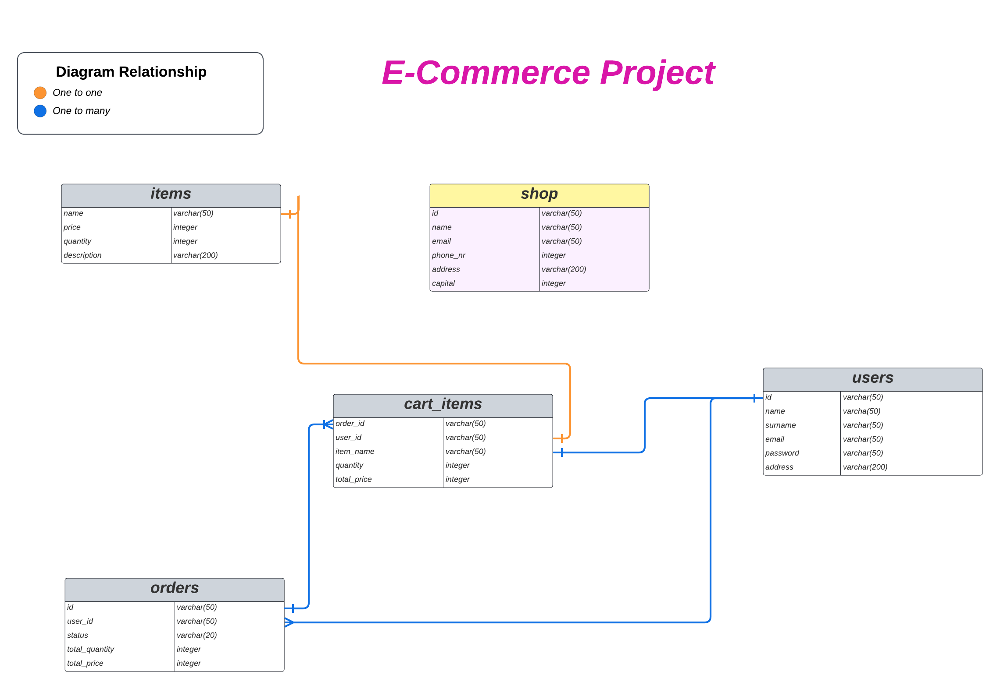

# E-Commerce API Shop - Project

This project became alive because [Me](https://github.com/AstaDru) and [Sironi](https://github.com/Sironi-00) had to create a REST API E-Commerce project from our Web Development course. With this in mind we have decided to build a shop. Our first step was to design ERD that made our project to go smoother with visualizing how our code suppose to be implemented. Accordingly to our ERD below there are shop, items, cart_items, users and orders tables.

## ✨ Technologies
This is a Back-end project was built using `nodeJs`, `npm`, `express`, `express-session`, `pg`, `dotenv`, `uuid`.

## 🚦 Installations
To run the project on you local machine you need to have nodeJs:v>= 0.8 and npm >= 1.4.16 and a postgres server

### Step 1
clone this repo or download the files

### Step 2
Create an database in postgres, ours is named `apishop-db`, Then import the `setup database.sql` into your database i.e. `apishop-db`.
<br># This will setup the database schema, relations, triggers, insert _fakedata_ and create a default user.


### Step 3
using terminal `cd` to the project folder and run `npm i`

### Step 4
Create a `.env` file in the project {_the values are for a postgres user and a database you would like to use_} 
```
 pgHOST=localhost
 pgUSER=postgres
 pgPASSWORD=secret123
 pgDATABASE=apishop-db
```
`PORT=3000` can also be added to the file to specify preferred port for the server to listen on, *ours is 3000*.

### Step 5
Then in the project folder `cd eCommerceAPI` and Run `npm start`
<br># It should print out "Listening on localhost:PORT"


## 🌏 Routes available:
base url: `localhost:3000/api`
| Routes | Method | Description |
| --- | :---: |--- |
| /register | POST | For creating new user account. Adding all given information to users table. |
| /login | POST | For logging users in, comparing their given email and password with our database users in users table. If they are correct we are authenticating them using express sessions. |
| /logout | GET | For logging user out, we ending express session. |
| /settings | PUT | For updating given user details in users table |
| /deleteuser | DELETE | For removing user from users table |
| /browse | GET | For displaying a list of all items in a shop. |
| /browse/:itemName | GET | For displaying information about one searched item by name from items table. |
| /cart | GET | For checking what items user has in his cart. |
| /cart/additem | POST | For adding an item to a cart with given quantity. |
| /cart/removeitem | DELETE? | For removing cart_item from user cart. |
| /cart/changeqty | PUT | For changing cart_item table quantity by name with given amount. |
| /cart/clear | DELETE | For clearing all cart_item in current user cart. |
| /cart/checkout | GET | For checkout user cart, generate order to be dispatched. |
| /cart/:cartId | GET | For viewing select cart_item in cart. |
| /orders | GET | For viewing all user orders. |

## 🧭 ERD SCHEMA
<br>
Since this is a simple REST API, any products selling company could have a use of it, let it be clothes, food shop selling groceries, gym company selling their plans as items, domains company selling domains as items etc...


## 🤝 Instructions
#### Tips:
1.   I would suggest to use "Visual Studio Code" editor. This software is free and easy to use. Link to download: [Visual Studio Site](https://code.visualstudio.com/download). It has instructions of how to install this software on your computer, laptop or any other device that you use. There are different installation options for windows and mac users. Just visit this site and you will find all information that you need to be able to install this software and use it.
2. More information about other great editors that are out there visit [links to editors](https://toolbox.hashnode.com/35-best-free-code-editors).

3. Use any suggestion from options below.
- Download this file, extract, save it in your computer and add it to your code editor.
- Copy this code repository and add it to your editor to view it.
- Create separate files in your code editor, copy code snapshots from this file and paste it to your code editor.

4. To view it on your browser window:
- #### If you are using Visual Studio Code follow instructions below:
    - To view a document of this API go to your terminal, make sure you are in 'swagger-editor-master' folder.
    - Type in 'npm start' or 'npm start --force'.
    - Type 'localhost:3001' in your browser. Navigate to your local storage by clicking the right button on your opened browser, click 'inspect'. A window will pop up on your right hand side. On the top click a field called 'Application', on the left hand side find a field 'Local Storage'. Click on it and click also on to another field below called 'http://loalhost:3001/'. There are 'Key' and 'Value' columns.

    - Copy all content from 'ecommerce swagger.yaml' file that exists in this project and paste it into 'Value' column that has a 'Key' row 'swagger-editor-master'.

    - Then refresh your browser and you will be able to see a current document of this REST API.

 - #### If using any other application editor follow instructions below:

    - You will have to follow your application editor commands to be able to view this document API.

    - Must start 'swagger-editor-master' file to be able to view this document in your browser.

    - If manage to start it, then copy all content from 'ecommerce swagger.yaml' file that exists in this project and paste it into your browser 'Local storage' 'Value' that has a 'Key' called 'swagger-editor-master'.

## ⚙️ Development

We used [pgAdmin](https://www.pgadmin.org/) to interface with the PostgreSQL serve, And we found it to be the best choice for us because it is Open Source and offers multiple features such as easy access to PSQL, An ERD Design base on the database schema and viewing actions like triggers as query.

[Postman](www.postman.com) was used for testing our API routes, request body(s) and responses.

<br>Our ERD is built with help from [Lucid](www.lucidchart.com) visual collaboration website.

<br>We used [Swagger](https://swagger.io/resources/open-api/) editor for documenting our REST API, because it is a great tool for building and documenting API's, free, easy to use, popular in web development environment.


## 🫶 Collaborators
_Sironi invested a lot of time to create this project with me. He had great ideas that we put together and added to this project._

_Asta has shown that she can develop products of great quality given the right tools and team, I felt like i was bringing her concepts to life. Thank you_

_This is a product of [Asta](https://github.com/AstaDru) and [Sironi](https://github.com/Sironi-00)'s hard work, and has helped us further learn about the greatness and stress for web development. "Many little components combine to form one great structure" and this project has made use feel closer to our goals._

## 📄 License
- This project is under MIT license.
- [More about this license](https://mit-license.org/)
